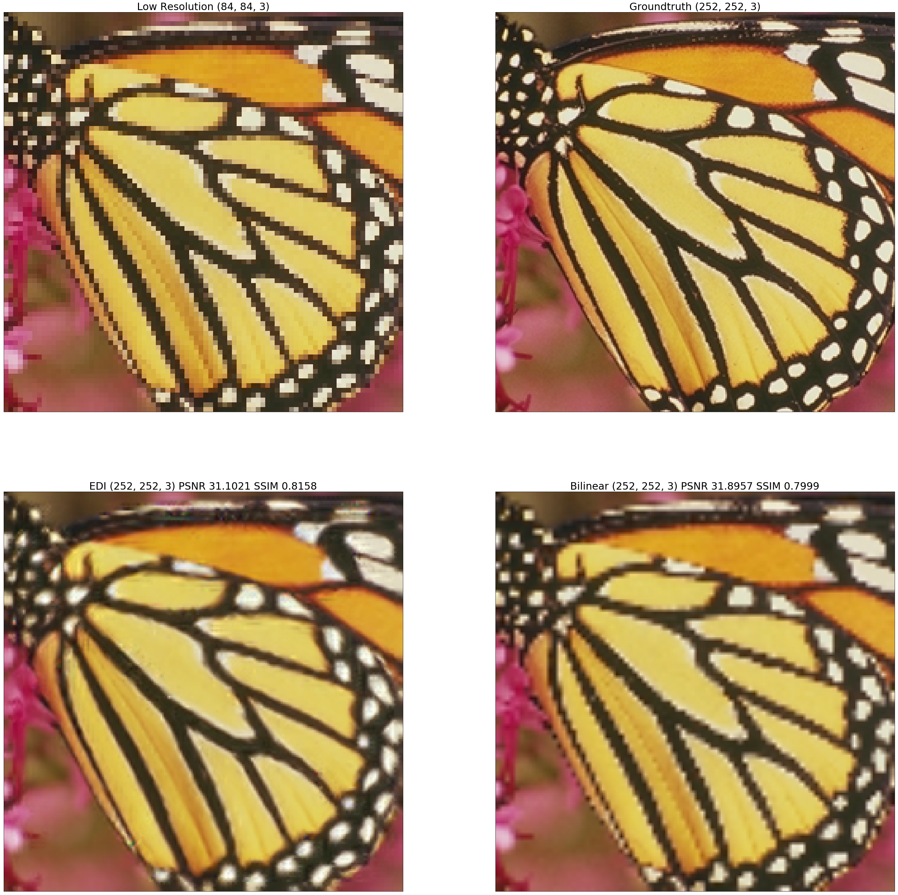

## [Edge-Directed Interpolation](http://chiranjivi.tripod.com/EDITut.html)

Zoom a grayscale image with any scaling factor with EDI (New Edge-Directed Interpolation)

<p align = 'center'>

</p>
<p align = 'center'>
Example: Upscale by the factor of 3 with sampling window size 4
</p>

**Example Code**

EDI_predict(img_input, 4, 3)

**Low Resolution (84, 84, 3)**

Input image of size (84, 84, 3)

**Groundtruth (252, 252, 3)**

Groundtruth image to compare with EDI and Bilinear Interpolation results

**EDI (252, 252, 3)**

Scaling up the input image by the factor of 3 with EDI

**Bilinear (252, 252, 3)**

Scaling up the input image by the factor of 3 with Bilinear Interpolation

## Implementation Details

This is a python script. Please make sure you have pip installed opencv-python, numpy, matplotlib.

## Documentation

```
    from edi import EDI_predict
    EDI_predict(img, m, s)
```

*img* is the input image
    
*m* is the sampling window size, not scaling factor! The larger the m, more blurry the image. Ideal m >= 4. 

*s* is the scaling factor, support any s > 0 (e.g. use s=2 to upscale by 2, use s=0.5 to downscale by 2)

### Citation

```
  @misc{Kirstihly/Edge-Directed_Interpolation,
    author = {Leying Hu},
    title = {New Edge-Directed Interpolation},
    year = {2020},
    howpublished = {\url{https://github.com/Kirstihly/Edge-Directed_Interpolation/}},
    note = {Online; accessed DD MM YYYY} 
  }
```

### Attributions

Please consider acknowledging this small project for research use. Thank you!

If you have any suggestion, please reach out to hu.leying@columbia.edu

My implementation is based on Xin L. and Michael T. O's [New edge-directed interpolation](https://ieeexplore.ieee.org/document/951537)

Special thanks to Parashar Krishnamachari's post [Edge-Directed Interpolation](http://chiranjivi.tripod.com/EDITut.html) to help me understand the logistic of the NEDI.
